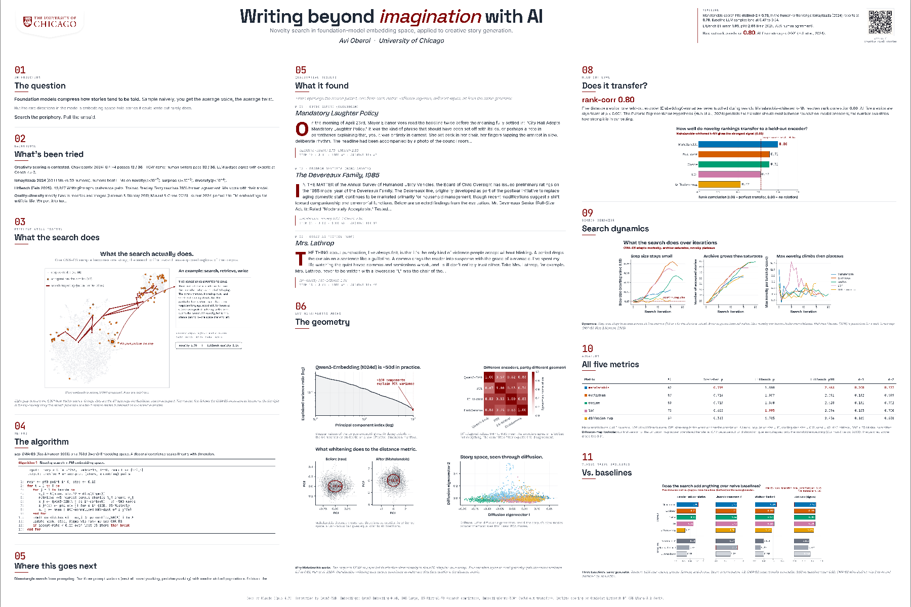

# Writing Beyond Imagination

Novelty search via CMA-ES in foundation-model embedding space, applied to creative story generation. We optimize Qwen3 embeddings to push a retrieval-conditioned LLM's openings toward the periphery of a 5,001-story New Yorker corpus.

**Poster / project page:** https://avioberoi.github.io/creative_novel_stories/

*Click the thumbnail for the full 24×36 PDF.*

## Key results

- Mahalanobis archive reaches **distinct-2 = 0.73** and **transfer correlation = 0.80** to held-out NV-Embed-v2; baseline LLM samples in the same pipeline land at 0.47–0.54.
- CMA-ES beats three naive baselines (random-LLM, greedy-farthest, diverse-beam) on the same generator: mean transfer correlation **0.63 vs 0.52**, distinct-1 by **2–4×**, distinct-2 by **~50%**.
- Honest scope (per Ismayilzada 2024, humans &gt; LLMs on novelty at p &lt; 10⁻⁷): we do not close the human–LLM gap, we shift the LLM output distribution toward the periphery.
